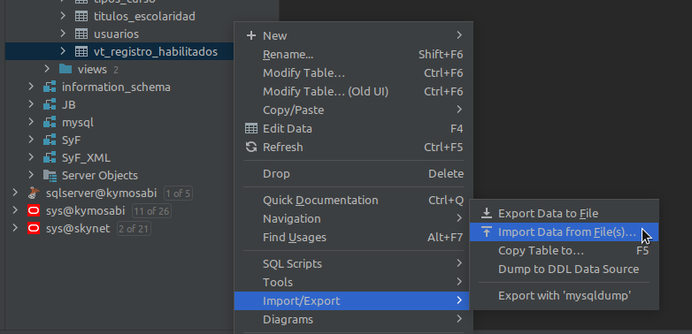
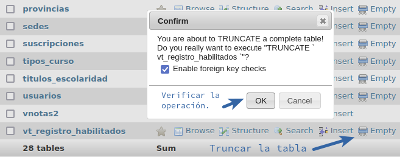

# Importación de datos de buscador

## Preproceso del archivo Excel ###

* Recibir el archivo en formato Excel, en el formato indicado por el siguiente archivo adjunto: 
  * [Archivo de ejemplo de importación de datos.](./files/base-buscador-sample.xls)

* Abrir el archivo con algún software de planilla de cálculos (recomendado [Libre Office Calc](https://es.libreoffice.org/descarga/libreoffice/))
* Exportar el archivo en formato __CSV__.
  * [Archivo de ejemplo de importación de datos exportado como CSV.](./files/base-buscador-sample.csv)
  
Una vez exportado el archivo en formato CSV, ese archivo se utilizará para generar la secuencia de __INSERT__ que es necesaria para importar los datos a MySQL.

### Conexión a la base de datos

Cada herramienta tiene sus propias características para conectarse a la base de datos, cuya configuración excede este documento. Todas las operaciones indicadas deben contar con una conexión activa a la base de datos.

## Importación a MySQL auxiliar

Los datos se importarán con alguna herramienta que permita tomar los datos en formato CSV y importarlos a una tabla MySQL.

En nuestro caso utilizamos __DataGrip__ de la empresa JetBrains. Se puede descargar desde [este link](https://www.jetbrains.com/es-es/datagrip/download/).

También se puede utilizar __MySQL Workbench__, que se puede descargar desde [éste link](https://dev.mysql.com/downloads/workbench/).

La importación de datos se tiene que realizar a la tabla `vt_registro_habilitados`, la cual tiene la siguiente estructura:

```
create table vt_registro_habilitados
(
    nombre        varchar(255)           null,
    cuil          varchar(11) default '' not null,
    categoria     varchar(20)            null,
    registro      varchar(20)            null,
    formacion     varchar(255)           null,
    localidad     varchar(255)           null,
    barrio        varchar(255)           null,
    observaciones text                   null,
    estado        varchar(1)             null,
    celular       varchar(255)           null,
    telefono      varchar(255)           null,
    email         varchar(255)           null,
    gd            int(1)                 not null,
    primary key (cuil, gd)
)
    comment 'Vista del registro de electricistas habilitados';
```

> LA TABLA DEBE ESTAR CREADA EN LA BASE DE DATOS CON EXACTAMENTE LA ESTRUCTURA INDICADA, SI NO LA IMPORTACIÓN NO FUNCIONARÁ

## Importacion con __DataGrip__

* Click derecho sobre la tabla `vt_registro_habilitados` y a continuación seleccionar la opción `Import Data from file(s)`.



* Una vez seleccionado el archivo a importar (el CSV que generamos previamente), se abre la ventan de configuración de la importación en la cual debemos especificar las siguientes configuracion:
    * El formato del archivo de origen (se debe indicar CSV)
    * Se debe tildar `First row is header`
    * Se debe verificar que la tabla de destino sea `vt_registro_habilitados`
    * El mapeo de campo (de qué columna del archivo se toman los datos y en qué columna de la tabla se graban)
    * También se puede configurar en qué archivo se generará el log de errores, pero si no se especifica indicará una ubicación por defecto.


* Una vez configurado el importador, haciendo click en IMPORT se comenzará el proceso.

## Importación con __MySQL Workbench__

La importación desde __MySQL Workbench__ se realiza seleccionando la herramienta `Table Data Import Wizard` desde el click derecho sobre la tabla `vt_registro_habilitados`


Esto abre un asistente paso a paso con las siguientes opciones:

* Selección del archivo de origen


* Selección de la tabla de destino


* Configuración de los campos (mapeo)


* Al hacer click en _Next_ en la última pantalla comienza el proceso de importación.

## Exportación de secuencia de __INSERT__

La exportación de secuencia de insert depende del uso de la aplicación PHPMyAdmin, la cual es una herramienta Web que nos deja gestionar bases de datos MySQL.

PHPMyAdmin viene incluída por defecto en varias plataformas de desarrollo, tales como XAMPP ([link de descarga](https://www.apachefriends.org/es/download.html)) o puede descargarse de manera independiente, desde el [siguiente link](https://www.phpmyadmin.net/).

El instructivo asumirá que se está utilizando una plataforma pre-configurada como XAMPP o que PHPMyAdmin ya se encuentra funcionando, no se darán instrucciones de instalación o configuración de la herramienta.

### Selección de tabla y exportación

* Se debe seleccionar en primera instancia la base de datos (el nombre de la base puede variar de acuerdo a como haya sido creada, se sugiere `ersep_segelec`)


* Una vez seleccionada la base de datos, dentro de la misma se debe seleccionar la tabla `vt_registro_habilitados`


* A continuación se debe seleccionar del menú la opción exportar


* Se debe configurar la salida


* Y la opción de datos


Todas las demás opciones deben dejarse en sus valores por defecto.

Una vez presionado el boton __GO__ se realizará la exportación a un archivo con extensión `.gzip`. Este archivo es el que se debe importar al servidor de destino.

## Importación en el server de destino

La importación se realiza utilizando la herramienta PHPMyAdmin, existente en el servidor de Volta, a la que se puede acceder mediante el panel de control del hosting: 

* [Panel de control](https://volta.net.ar:2083/) 

Una vez en el panel de control se debe seleccionar la base de datos correspondiente y realizar dos pasos:

* Eliminar los datos existentes



* Importar los datos


Una vez seleccionada las opciones indicadas se debe presionar el botón __GO__ para realizar la importación de datos.
