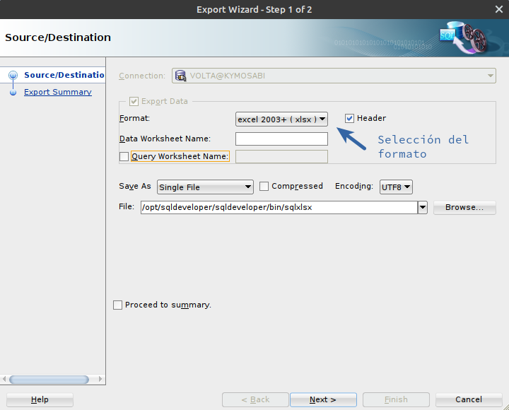

# Inclusión manual de datos en registro

Se ha desarrollado un procedimiento para la incorporación manual de datos en el registro de instaladores habilitados.

El script es el siguiente:

``` sql

DECLARE
v_primer_nro_registro_libre number; 
v_nro_registro number;
v_nro_registro_str varchar2(20);
vid_postulante varchar2(20);
vid_informe_tecnico number;
vcount number;
BEGIN
    select NVL(max(registro_hasta),0)+1 into v_primer_nro_registro_libre from ERSEP_SEGELEC.t_informes_tecnicos;
    
    v_nro_registro := v_primer_nro_registro_libre;
    
    insert into ERSEP_SEGELEC.T_INFORMES_TECNICOS (NRO_INFORME_TECNICO,FEC_INFORME_TECNICO,REGISTRO_DESDE,OBSERVACIONES)
    values (:NRO_INFORME_TECNICO,SYSDATE(),v_nro_registro,'MANUAL (gen_informe_tecnico_manual.sql)')
    returning ID_INFORME_TECNICO into vid_informe_tecnico;
    
    DBMS_OUTPUT.PUT_LINE ('GENERADO INFORME TECNICO '||vid_informe_tecnico||'. Insertando detalle...');
    vcount := 0;
    FOR r IN (SELECT p.id_postulante FROM
         ersep_segelec.t_solicitudes_registro sol
            JOIN ersep_segelec.vt_postulantes_cidi     p ON sol.id_postulante = p.id_postulante
            LEFT JOIN ersep_segelec.t_det_informes_tecnicos det ON sol.id_postulante = det.id_postulante
            WHERE
                det.id_postulante IS NULL
            ORDER BY
                nombre ASC)
    LOOP
        v_nro_registro_str := substr(r.id_postulante,3,8)||'-'||lpad(v_nro_registro,5,'0');
        BEGIN
        
            DBMS_OUTPUT.PUT_LINE ('INSERTAR '||r.id_postulante||' EN T_DET_INFORMES_TECNICOS'||' con Registro: '||v_nro_registro_str);
            INSERT INTO ERSEP_SEGELEC.T_DET_INFORMES_TECNICOS (ID_INFORME_TECNICO,ID_POSTULANTE,NRO_REGISTRO)
            VALUES (vid_informe_tecnico,r.id_postulante,v_nro_registro_str);
            DBMS_OUTPUT.PUT_LINE ('INSERTADO '||v_nro_registro_str||' EN T_DET_INFORMES_TECNICOS');
        EXCEPTION
            WHEN OTHERS THEN
                DBMS_OUTPUT.PUT_LINE ('ERROR AL INSERTAR '||v_nro_registro_str||' EN T_DET_INFORMES_TECNICOS:'||SQLERRM);
        END;
        v_nro_registro := v_nro_registro+1;
        vcount := vcount+1;
    END LOOP;
    -- Para ajustar el ultimo numero, que ya viene incrementado
    v_nro_registro := v_nro_registro-1;
    DBMS_OUTPUT.PUT_LINE ('Actualizando el �ltimo numero de registro: '||v_nro_registro);
    update ERSEP_SEGELEC.T_INFORMES_TECNICOS set REGISTRO_HASTA = v_nro_registro
    where id_informe_tecnico = vid_informe_tecnico;
    DBMS_OUTPUT.PUT_LINE ('INSERTADOS '||vcount||' registros: ');
END;
```

El archivo se puede descargar desde el [siguiente link](./scripts-soporte-mantenimiento/gen_informe_tecnico_manual.sql).

Al ejecutar el script se solicita el `:NRO_INFORME_TECNICO` (Número del informe técnico) que debe ser indicado por el usuario.

## Generación del Excel de Informe

Una vez insertados los postulantes en el registro existe la posibilidad de generar un archivo Excel, con todos los datos, el cual es util para la elaboración de la resolución.

El archivo Excel se genera a partir de la siguiente consulta:

``` sql
select 
    p.id_tipo_documento as tipo, p.nro_documento as dni, p.apellido, p.nombre, d.nro_registro, 'III' as categoria, d.id_postulante as cuil 
from 
    ersep_segelec.t_informes_tecnicos i
join 
    ersep_Segelec.t_det_informes_tecnicos d on i.id_informe_tecnico = d.id_informe_tecnico
join 
    ersep_Segelec.vt_postulantes_cidi p on d.id_postulante = p.id_postulante
where 
    i.nro_informe_tecnico = :nro_informe_tecnico
order by 
    substr(d.nro_registro,instr(d.nro_registro,'-'))
```

> NOTA: Se debe indicar el mismo numero de informe técnico que en la generación, para la generación del archivo Excel asociado.

El archivo con el query se puede descargar desde el [siguiente link](./scripts-soporte-mantenimiento/generar-excel-informe-tecnico.sql).

Los resultados de esta query se deben exportar, desde SQL Developer, haciendo uso de la opción Export (accesible haciendo click derecho sobre la grilla de resultados)

Las opciones son muy sencillas, y la más importante es la selección correcta del formato del archivo de exportación, tal como se ve en la primera página del asistente.


